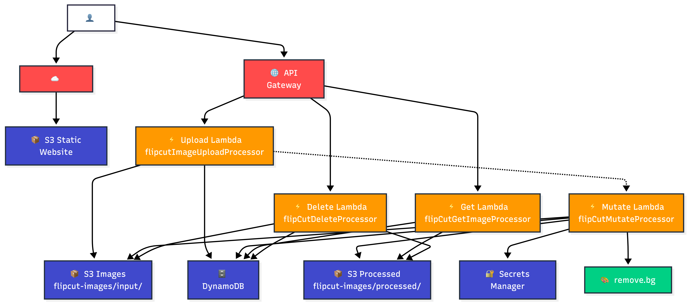
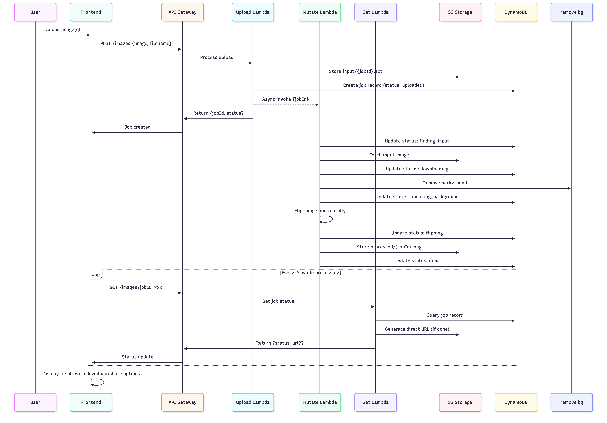

# FlipCut

FlipCut is a web application that removes backgrounds from images and horizontally flips them. Built as a full-stack solution with AWS API Gateway, Lambda backend and React frontend.

## System Architecture



## Data Flow



## Architecture

The application follows a serverless architecture with clear separation of concerns:

- **Frontend**: React + TypeScript + Vite with hash-based routing
- **Backend**: AWS Lambda functions handling upload, processing, retrieval, and deletion
- **Storage**: S3 for image files, DynamoDB for job status tracking
- **API**: HTTP API Gateway with CORS support and direct S3 URLs for sharing

## Technical Implementation

### User Experience Design

The interface prioritizes clarity and feedback throughout the user journey. File upload supports both drag-and-drop and click-to-browse interactions, with immediate visual feedback for drag states. The application handles both single and multi-image workflows seamlessly — single uploads show inline processing with a blurred preview that fades to the final result, while multiple uploads display individual progress bars with real-time status updates.

Error states are contextually aware, distinguishing between upload failures, network issues, processing timeouts, and validation errors. Each error type uses distinct visual styling and iconography. Success states provide immediate feedback with auto-dismissing banners and visual confirmation through checkmarks and progress completion animations.

### State Management & Real-time Updates

The application implements sophisticated state management without external libraries. Job status polling uses exponential backoff with configurable timeouts, and an in-memory cache prevents redundant API calls when navigating between views. Recent jobs persist in localStorage with thumbnail generation, providing instant access to processing history across sessions.

Real-time progress tracking maps backend processing stages to visual progress bars, giving users clear insight into processing status. The system gracefully handles edge cases like network interruptions, processing failures, and concurrent operations.

### Accessibility & Responsive Design

The interface meets WCAG accessibility standards with comprehensive keyboard navigation, ARIA labels, and screen reader support. Modal dialogs implement proper focus trapping and escape key handling. Interactive elements provide clear visual feedback and maintain adequate color contrast ratios.

Responsive design adapts to mobile devices by hiding button text while preserving icon-based interactions. Touch targets meet minimum size requirements, and the layout reflows appropriately across screen sizes.

### Code Quality & Type Safety

The codebase maintains strict TypeScript typing throughout, with no `any` types or type assertions. Component interfaces are well-defined, and shared constants prevent magic numbers and strings. Error boundaries and proper cleanup prevent memory leaks and handle edge cases gracefully.

The React implementation follows modern patterns with proper dependency arrays, cleanup functions, and state management. Components are modular and reusable, with clear separation between presentation and business logic.

### Performance & Optimization

Image handling is optimized with client-side thumbnail generation and efficient canvas operations. The build process generates hashed asset filenames for optimal caching, and the application loads only necessary resources. API calls are debounced and cached appropriately to minimize server load.

File validation happens client-side before upload, providing immediate feedback and preventing unnecessary network requests. The application supports concurrent uploads with proper error isolation — individual file failures don't affect other operations.

## Deploying

Build and deploy Lambda functions:

```bash
cd backend/[function-name]
npm install
npm run build
zip -r function.zip dist/ node_modules/
# Upload function.zip to corresponding Lambda in AWS Console
```

Build and deploy frontend:

```bash
cd frontend
npm run build
# Upload contents of dist/ to S3 bucket
# Invalidate CloudFront cache
```

The application requires AWS services: Lambda, API Gateway, S3, DynamoDB, and Secrets Manager for the remove.bg API key.

## Design Decisions & Tradeoffs

### URL Strategy: Permanent vs Presigned

The system initially used presigned S3 URLs for security, but shifted to permanent public URLs for processed images. This tradeoff prioritizes user experience over strict access control — permanent URLs enable effective client-side caching and persistent sharing links. Since processed images are meant to be shared publicly anyway, the security benefit of presigned URLs was minimal while creating friction in the user experience. Local caching becomes meaningless if cached URLs expire, forcing unnecessary server requests and degrading performance.

### User Experience: Seamless Flow vs Independent Pages

The application balances two competing needs: seamless single-page experience and shareable independent URLs. Single image uploads remain inline to maintain flow, while multi-image uploads use a job list that links to individual pages. This hybrid approach preserves the smooth experience for simple cases while supporting the complexity of batch operations. Independent job pages remain essential for sharing and bookmarking, even though they break the single-page flow.

### Multi-Image Upload Strategy

Multi-image processing presented a UX challenge — showing all jobs inline would clutter the interface, while navigating away loses context. The solution processes all images on the home page with individual progress tracking, then allows users to click through to detailed views. This keeps the primary workflow clean while providing access to individual results. An alternative approach of showing one large progress bar for the batch would hide individual job status and make error handling more complex.

### Infrastructure: AWS Native vs Custom Solutions

The architecture leverages AWS managed services for rapid development and built-in scalability. Lambda provides automatic scaling without server management, DynamoDB handles concurrent job tracking, and S3 offers reliable storage with direct URL access. This approach trades some cost optimization for development speed and operational simplicity. A custom solution might be more cost-effective at scale but would require significant infrastructure management.

### Deployment: Manual vs Infrastructure as Code

The current deployment uses manual AWS console configuration for speed during the 48-hour development window. The next iteration would implement AWS CDK to codify IAM roles, API Gateway integrations, and service permissions. Manual deployment creates consistency risks and makes environment replication difficult, but enabled rapid iteration during initial development.

### Data Lifecycle: Immediate vs Scheduled Cleanup

The system currently retains all processed images indefinitely. A production deployment would implement S3 lifecycle policies for automatic deletion after 30 days, with clear user communication about data retention. This tradeoff between storage costs and user convenience requires balancing business constraints with user expectations.

### Deletion Granularity: Individual vs Batch Operations

The interface provides individual delete buttons and a "Delete All" option, but omits multi-select functionality. User testing suggested most users either want to remove specific recent items or clear their entire history. Multi-select would add interface complexity for a use case that falls between these two common patterns.

### User Testing Insights

Informal testing revealed several UX improvements: moving the call-to-action description above the upload zone increased conversion, displaying original filenames instead of job IDs improved recognition, and adding relative timestamps ("2h ago") felt more natural than absolute dates. Success and error banners provided crucial feedback that was missing in earlier iterations. Local caching for instant re-rendering of completed jobs significantly improved perceived performance.
